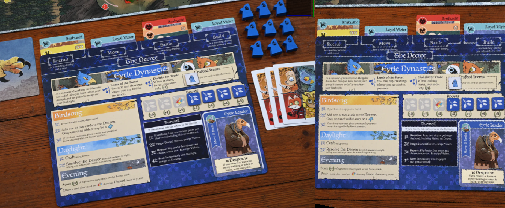

# TheRootOfComputerVision

## Project Overview
The goal of this project was to develop a machine vision program that can keep track of the state of a player's game (fig. 1) board in the game Root. Root is a very complex game with asymmetrical architecture (meaning each player has a unique set of faction specific rules). As such, it is easy to make mistakes especially for newer players. On a high level, the program locates different objects within a player board including various cards and tokens, and stores their location and type. This information can then be applied to check the legality of moves, live during a game. Our MVP is not a fully function checker but provides a jumping off point for future exploration. We decided to focus on Eyrie Dynasties being one of the most dynamic player boards. Our MVP identifies Eyrie Dynasties faction roost tokens and cards distinguished by suit as shown in Figure 1 below. 

<i>Figure 1: Eyrie game board</i>

The Eyrie Dynasties decree consists of four possible card locations (in files) with four possible card types. Cards are first identified by suit, then sorted into lists based on their file, Recruit, Move, Battle, and Build (as shown on the player board). As for the roosts, the Eryie Dynasties faction only cares about the quantity, so the program will output an integer corresponding to the number of these tokens detected on the player board. For our MVP, we will assume that the Eyrie Dynasties player board will dominate the photo. 

In addition to the decree and roost detection, we considered a number of stretch goals ranging from detecting item tokens (e.g. the boot in the top right corner), to detecting factions beyond just Eyrie Dynasties and their respective tokens.

## Requirements
- cv2

### Learning Goals
- We aimed to walk away from this project with experience using specific CV algorithms/techniques, and a strong understanding of how to approach a machine vision problem. 

- We also hoped to get a view behind the curtain regarding machine vision algorithms, whether that means writing our own, or exploring how open source algorithms work.

- On a less technical level, we hoped to explicitly devote time to--as a team--exploring machine vision project examples and open source software available to us to get a more complete understanding of the resources at our disposal.

## Process Overview
After a little experimentation, we chose to rely entirely on deterministic image manipulation algorithms using openCV. This is possible because of the controlled nature of the player boards and their components. The boards will always be the same size with the same color scheme and organization, a feature that we use to our advantage extensively in this project. Thus, we arrive at one of our first major MVP assumptions: the image perfectly isolates the board from a top down view. We were able to largely diminish the limitations of this assumption as described below.  

### Board Orientation
The initial problem we hoped to tackle was being able to take a photo of the player board from any angle and transform it to a clear, top down view. As the rest of mvp goals revolved around searching different portions of the player board, having a standardized view of that board is integral. This problem ended up taking the majority of our time and was split into two parts. 

- Finding known key points in the raw image to define the current orientation of the board via a three dimensional matrix.
- Applying the matrix transformation to the entire image of the board to construct a top down view.

#### Key Point Detection
For key point detection, the goal is to find a either points of a region that is distinct enough from the rest of the board that it can be recognized, no matter the orientation within the image. For the Eyrie player board, after initial testing and deliberation, we decided on the birdsong section of the board, as seen in figure 2, as our standout region. Our goal ws to use the four corners as the key points for calculating the orientation of the board for the later translation.

<i>Figure 2: Birdsong region of Eyrie game board</i>

In order to find the four corners of the birdsong region, we relied on a combination of opencv's `findContours` functions and `inRange` function. Starting from the initial image, by providing a lower and upper bound for the `rgb` values, `inRange` returns a binary image with white, or `255`, at regions within that color range and black, or `1`, at those outside the range. Then, with this binary image, `findContours` locates the contours, or regions of color, within the image. The hope is that from this process the biggest contour is the one surrounding the birdsong region. This, however, didn't always end up being the case due to noise in the background from objects such as the birds within the top banner art, as shown in figure 3 below, as well as segmentation of the birdsong region, resulting from the branch of the right side of the box, as seen in figure 2.

<i>Figure 3: Eyrie game board banner</i>

First, in order to remove the segmentation of the birdsong region, a general blur was preformed on the whole image, using the `resize` function. The effect of blur on the contours can be seen in figures 4 & 5 below.

<i>Figure 4: Birdsong contour without blur</i>

<i>Figure 5: Birdsong contour with blur</i>

Alongside this, in order to remove the noise, the process of getting the birdsong contour was split into two steps.

First, we found an even more distinguishable portion of birdsong using a smaller color range. This portion was always able to be identified when relatively consistent lighting was provided. This region can be seen in figure 6 below.

<i>Figure 6: Initial birdsong region</i>

Second, We found the full birdsong contour with the original color range, but only in the region around the original distinguished portion. This is performed by creating a rectangle around the region and using opencv's `bitswise_and` function to get only the region of the original image within that rectangle. This search region can be seen in figure 7 below.

<i>Figure 7: Birdsong search region</i>

By first determining a smaller region in which to search, the process became much more accurate and the final contour is achieved. For the board transformation, however, we specifically need the four corners of this new contour. For this, we utilize the `appx_best_fit_ngon` function within our helper functions file to find the quadrilateral with the smallest area the contains every point within the contour. We found this function through stack overflow and due to the time constraints never dived deep into it's inner workings. This provided us with four points incredibly close to four corners of the contour. Due to the incredibly sensitive nature of the board transformation process, however, we the finally looped the `move_closest_point_toward` function on each of the four points. What this did was shift them closer to the closest point within the actual contour. By performing this final translation, we finally arrived at the four points used for the board transformation. These four points and the box the enclose can be seen in figure 8 below.

<i>Figure 8: Birdsong region bounding box</i>

#### Board Transformation
The actual transformation is implemented in the transform_board() function in transform_eyrie_board.py and is largely enabled by an openCV function getPerspectiveTransform(). getPerspectiveTransform() does all the heavy lifting, taking in two sets of four (x, y) points and computing the transformation that moves the first set of points to the second set of points.getPerspectiveTransform() can then be used in conjunction with another function, warpPerspective(), which applies the transformation to an entire image. transform_board() takes in the corners of birdsong as the first four points and the aforementioned openCV functions according to a given set of transformed points, both provided as an argument. Notably, we specifically chose to leave the second set of points as an argument so the same function could be used for other faction boards (in addition to Eyrie Dynasties) which all have the same birdsong rectangle but in a different size. 
It is important to note one particular assumption that transform_board() makes to function correctly. The function cannot assume that the inputted first set of points are in the same order as the second set because the point detection algorithm does not detect where the points are in reference to the rest of the board. Thus, it must reorder the first set of points to match the second set. Essentially, transform_board() begins with the assumption that the farthest left point must be one of the two leftmost corners of the birdsong rectangle, and then, through a series of distance comparisons and height comparisons, reorders the list to be top-left, bottom-left, top-right, bottom-right. The reordering, however, only works if the board is not upside down, otherwise that initial assumption is wrong. Hence, for the transform_board() function to work for any orientation, some initial processing must be done first. 

<i>Figure 9: Player board image before and after transformation</i>

### Roost Detection
Here, we take advantage of the board transformation to find the roosts based on their size in the transformed image. The function detect_roosts() in roost_detection.py first converts the transformed image into a binary image, highlighting only elements that match the blue color scheme of the roost tokens. It then implements the openCV contour search algorithm which isolates each roost as a unique contour among many many others. Finally, it filters all of the detected contours by area to yield only the roosts and outputs the remaining number of contours. Notably, the roost detection only works if the roosts are mostly in their proper locations so they are sufficiently separated from each other and surrounding blue features.

<i>Figure 10: Roosts color range binary image</i>

### Decree Detection
The decree detection uses a similar approach to the roost detection with a little added complexity due to the much larger variety of possible states. The function detect_decree() in decree_detection.py generates four different binary images, highlighting the respective colors of the banners of the four card types: mouse (orange), bunny (yellow), fox (red), and bird (blue). Luckily, the banners are quite pure in color, allowing these binary images very effectively filter out the unrelated features of the board. The effectiveness of this filter is key for the next step. To account for the inconsistent potential positions of each card in the decree (i.e. how close they are together and how aligned they are with each column), we decided that we can't rely on a contour search like we did for the roosts. Instead, we approximate the number of pixels in the card banner for each type and determine the number of cards of that type based on the total number of pixels. 
Column filtering once again relies on the board transformation. Because the boards are a set width, we assume that the transformation can effectively crop the image to align with the edges of the board. This cropping allows the program to filter detected cards by segmenting the image into four parts. It first approximates the center of the board using the inside edge of birdsong, and then approximates the subdivisions measuring from the center. Notably, this would not work if we didn't know that the actual width of each subdivision is approximately constant (due to the designations on the board).

<i>Figure 11: Card type color range binary images</i>

## Reflection

### Challenges
We encountered a lot of challenges throughout the whole process. The most formidable of which had to do with the birdsong region corner detection and transformation of the board (as detailed in the process review). Within the birdsong region corner detection, we initially ran into trouble with image noise. Due to the delicate nature of the transformation, even small detection inaccuracies have major consequences. We were eventually able to circumvent this through a secondary regional search. However, we continued to run into issues due to the existence of a tiny branch within the artwork. Luckily, by tampering with the resolution of the image, we were able to find a happy medium that preserved the key points of birdsong while mostly filtering out the branch. 

From a broad lens, most of our major challenges over the course of this project had to do with image inconsistencies. There are a lot of factors we can't control about the provided image, including but not limited to, scale, perspective, resolution, lighting, and exposure. We spent the majority of our time trying to tackle some of these with the board transformation, however, we were not able to tackle the lighting-related issues. Additionally, we spent a lot time wrestling with image resolution, striking a balance between accuracy, and abstraction. It became clear by the end of the project that the key to success with a deterministic machine vision program like ours came down to how well the raw image can be calibrated to a desired standard on all accounts. 

### Improvements
There are certainly a fair number of improvements that could be made moving forward. For starters, despite the multi-step process for the birdsong edge detection that we did, it's still far from perfect. As it doesn't work with every image, as well as every orientation, there is still a lot of room for improvement. One consideration is experimenting with different key point finding algorithms. Furthermore, while we see birdsong as the most obvious region to locate, there could be other really good key points that haven't occurred to us. 

As far as raw image processing is concerned, implementing an exposure calibration algorithm would go a long way for making the program more versatile. We could use a known image with an easily detectable feature like an april tag to essentially scale up or down the light of the image. Considering how important color detection is, getting the scale right is essential for use in a variety of conditions. As for the orientation issues, an easily detectable feature such as this would also allow use to detect whether the image is right side up or not, solving that transformation limitation as well.. Another large improvement that could be made is adding a system to adapt to different lighting. For our system to work we need consistently good lighting, and in an actual game that likely won't be the case.

Alongside the general improvements we could make, there is also still a lot to add related to the game, Root, itself. We could make our system also detect the items and leader of the Eyrie faction, as those are currently unaccounted for variables in our images. There are also a huge number of factions in addition to Eyrie Dynasties that all have unique pieces to detect. Just identifying each one from an image of the entire player area would be a big milestone. 
ren't able to get to. There are also the other three factions and all the intricacies they may contain. With that we could also make our system be able to simultaneously detect and track all four at the same time, or we could get it to work with a constant video, rather than a simple image.

Overall, there are a lot of improvements that can be made, both of the algorithm and consistency side, as well as on the content side.

### Takeaways
Generally, computer vision takes a lot more thought, steps, and debugging than we initially thought. It's not an easy process, despite how our brains make it appear. It's also good some times to lean on some of the system other people have made. This can be shown in part with some of the code we used from stack overflow, but we could, and honestly maybe should, have used some already developed key point detection to help with the board transformation. While it was good experience working through the troubles, we could have moved on to some of our other stretch goals had we had more time.